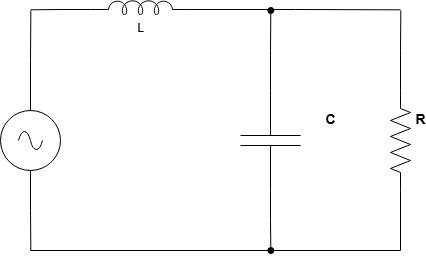

# Filtros Butterworth

Programa MATLAB para projetar Filtros Passa-Baixas e Passa-Altas de segunda ordem para separar áudio entre baixas e altas frequências.

# Circuito do Filtro Passa-baixa

### Função de transferência obtida a partir da análise desse circuito

$$\frac{\frac{1}{LC}}{(j\omega)^2 + \frac{1}{RC}j\omega + \frac{1}{LC}}$$

### Equação Geral da Função de Transferência

$$\frac{\omega_c^2}{(j\omega)^2 + \frac{\omega_c}{Q}j\omega + \omega_c^2}$$

Comparando ambas as equações, conseguimos extrair duas expressões para resolver duas incógnitas.  

$$\omega_c^2 = \frac{1}{LC}$$
$$\frac{\omega_c}{Q} = \frac{1}{RC}$$

Tomando $Q = \frac{\sqrt{2}}{2}$ podemos escrever as expressões que definem C e L  
  
$$C = \frac{\sqrt{2}}{2R\omega_c}$$  
$$L = \frac{R\sqrt{2}}{\omega_c}$$  
