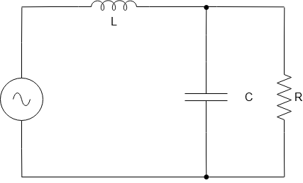
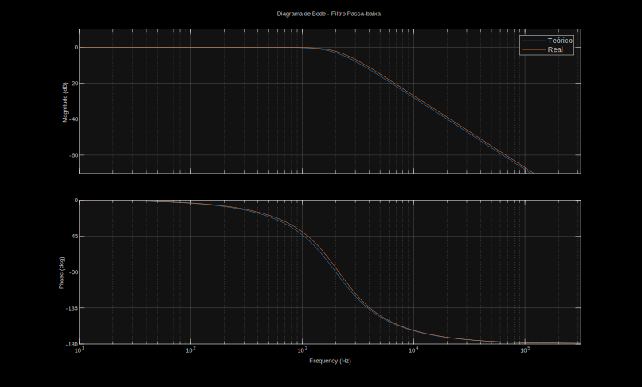
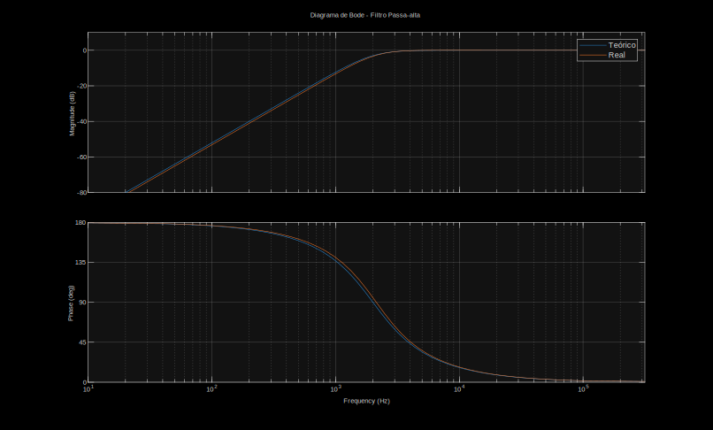

# Filtros de Áudio Butterworth: Separação de Frequências

Programa em MATLAB para projetar Filtros passivos Passa-Baixas e Passa-Altas de 2ª ordem, focados na separação de sinais de áudio. Inclui a seleção automática de componentes reais de prateleira e a validação gráfica do projeto teórico.

## Como Utilizar

### Pré-requisitos
Para executar a simulação corretamente, você precisará de:
* **MATLAB** instalado em sua máquina.
* **Control System Toolbox** instalada (necessária para as funções `tf` e `bode`).

### Passo a Passo da Simulação
1. Faça o download ou clone este repositório para o seu computador.
2. Abra o arquivo principal do script `.m` no MATLAB.
3. Execute o código clicando em **Run** no painel superior.
4. O programa solicitará a interação no *Command Window*. Digite os valores numéricos do seu projeto e pressione `Enter`:
   * Frequência de corte.
   * Impedância da carga.
5. O script finalizará a execução automaticamente. 

### Resultados Esperados
Ao final da execução, o console exibirá os valores exatos calculados (Teóricos e Reais) juntamente com a margem de erro. Simultaneamente, o MATLAB abrirá duas novas janelas contendo os Diagramas de Bode para a sua análise visual.

# Circuito do Filtro Passa-baixa


### Função de transferência obtida a partir da análise desse circuito

$$\frac{\frac{1}{LC}}{(j\omega)^2 + \frac{1}{RC}j\omega + \frac{1}{LC}}$$

---

# Circuito do Filtro Passa-alta


### Função de transferência obtida a partir da análise desse circuito

$$\frac{(j\omega)^2}{(j\omega)^2 + \frac{1}{RC}j\omega + \frac{1}{LC}}$$

---

### Equação Geral da Função de Transferência

$$\frac{\omega_c^2}{(j\omega)^2 + \frac{\omega_c}{Q}j\omega + \omega_c^2}$$

Comparando a função de transferência do passa-baixa com a equação geral, conseguimos extrair duas expressões.  

$$\omega_c^2 = \frac{1}{LC}$$
$$\frac{\omega_c}{Q} = \frac{1}{RC}$$

Tomando $Q = \frac{\sqrt{2}}{2}$ podemos resolver o sistema e obter as seguintes expressões para L e C:  
  
$$C = \frac{\sqrt{2}}{2R\omega_c}$$  
$$L = \frac{R\sqrt{2}}{\omega_c}$$  

---

# Implementação em MATLAB

O código desenvolvido automatiza o cálculo e a validação do projeto. A lógica está dividida entre as seguintes etapas:  

1. **Variáveis de Inicialização:** Pede para o usuário informar a frequência de corte em Hertz e a impedância da carga em Ohms.
2. **Vetores de L e C:** Inicializa dois vetores guardando os valores comerciais de indutância e capacitância.
3. **Cálculo de L e C:** Usa as expressões encontradas para calcular L e C e percorre o vetor dos valores reais buscando a menor diferença com os valores calculados.
4. **Cálculo das diferenças:** Mostra a diferença entre os valores calculados e reais dos componentes e da frequência de corte.
5. **Diagramas de Bode:** Usa as funções de transferência encontradas para plotar os gráficos que mostram o comportamento esperado com os componentes calculados e o real com os componentes comerciais.

---

# Resultados

Seguindo as instruções do trabalho, foi utilizado o programa para os parâmetros de entrada $f = 2kHz$ e $R = 8ohms$ e obtivemos os seguintes resultados:

```text
Indutância Teorico (L): 0.90 mH  
Indutância Real: 0.82 mH  
Capacitância Teorico (C): 7.03 μF  
Capacitancia Real: 6.80 μF  
  
Diferença entre os indutores: 0.08 mH  
Diferença entre os capacitores: 0.23 μF  
Diferença na frequência de corte: 131.37 Hz  
```
---

## Gráficos de Bode

### Passa-baixa


### Passa-alta


